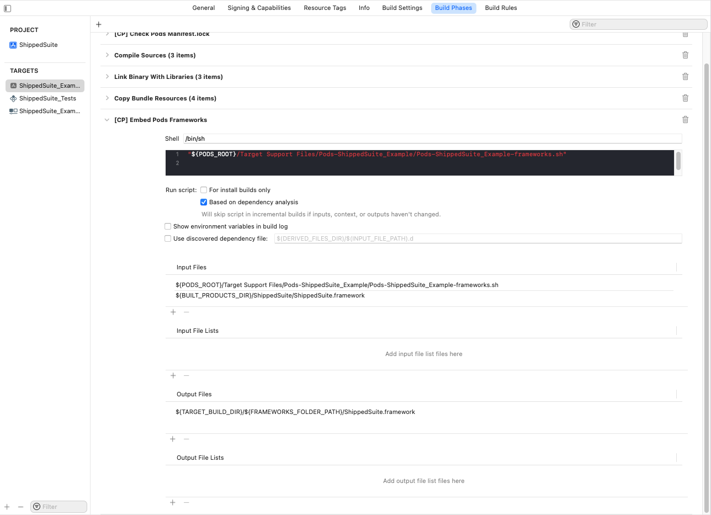

# ShippedSuite iOS SDK

 [](https://cocoapods.org/pods/ShippedSuite)
 [](https://cocoapods.org/pods/ShippedSuite)
 [](https://github.com/InvisibleCommerce/shipped-suite-ios-client-sdk/blob/main/LICENSE)
 [](https://cocoapods.org)
 [](https://github.com/Carthage/Carthage)
 [](https://www.swift.org/package-manager)
 [](https://codecov.io/gh/InvisibleCommerce/shipped-suite-ios-client-sdk)

Shipped Shield offers premium package assurance for shipments that are lost, damaged or stolen. Instantly track and resolve shipment issues hassle-free with the app.

## Example

To run the example project, clone the repo, and run `pod install` from the Example directory first.

## Requirements

The ShippedSuite iOS SDK requires Xcode 13.3.1 or later and is compatible with apps targeting iOS 11.0 or above.

## Installation

The ShippedSuite iOS SDK is available through [CocoaPods](https://cocoapods.org/), [Carthage](https://github.com/Carthage/Carthage), [SPM](https://www.swift.org/package-manager).

### CocoaPods

If you haven't already, install the latest version of [CocoaPods](https://cocoapods.org/).
If you don't have an existing `Podfile`, run the following command to create one:
```ruby
pod init
```
Add this line to your Podfile:
```ruby
pod 'ShippedSuite'
```
Run the following command
```ruby
pod install
```
Don’t forget to use the `.xcworkspace` file to open your project in Xcode, instead of the `.xcodeproj` file, from here on out.
In the future, to update to the latest version of the SDK, just run:
```ruby
pod update ShippedSuite
```

### Carthage

If you haven't already, install the latest version of [Carthage](https://github.com/Carthage/Carthage).
To use it, you need create a `Cartfile` and add this line to your Cartfile:
```ogdl
github "InvisibleCommerce/shipped-suite-ios-client-sdk"
```
Run the following command
```ruby
carthage update --use-xcframeworks
```
Drag the built `.xcframework` bundles from `Carthage/Build` into the "Frameworks and Libraries" section of your application’s Xcode project.

### Swift Package Manager

[Add package dependency from xcode](https://developer.apple.com/documentation/swift_packages/adding_package_dependencies_to_your_app).

## Setup

Import SDK.

```objective-c
#import <ShippedSuite/ShippedSuite.h>
```

Configure the SDK with your ShippedSuite publishable API key.

```objective-c
[ShippedSuite configurePublicKey:@"Public key"];
```

If you want to test on different endpoint, you can customize mode. The default is Development mode, so make sure to switch to Production mode for your production build. 

```objective-c
[ShippedSuite setMode:ShippedSuiteProductionMode];
```

### Create a Widget view with offers

You can initialize it and put it where you want.

```objective-c
SSWidgetView *widgetView = [[SSWidgetView alloc] initWithFrame:CGRectMake(x, y, width, height)];

SSWidgetViewConfiguration *configuration = [SSWidgetViewConfiguration new];
configuration.type = ShippedSuiteTypeShield;
configuration.isInformational = NO;
configuration.isMandatory = NO;
configuration.isRespectServer = YES;
widgetView.configuration = configuration;

widgetView.delegate = self;
```

Or you can use it in storyboards.

Whenever the cart value changes, update the widget view with the latest cart value. This value should be the sum of the value of the order items, prior to discounts, shipping, taxes, etc. 

```objective-c
[widgetView updateOrderValue:cartValueRoundedNumber];
```

To get the callback from widget, you need implement the `SSWidgetViewDelegate` delegate.

```objective-c
#pragma mark - SSWidgetViewDelegate

- (void)widgetView:(SSWidgetView *)widgetView onChange:(NSDictionary *)values
{
    BOOL isSelected = [values[SSWidgetViewIsSelectedKey] boolValue];
    NSLog(@"Widget state: %@", isSelected ? @"YES" : @"NO");
    
    NSDecimalNumber *shieldFee = values[SSWidgetViewShieldFeeKey];
    if (shieldFee) {
        NSLog(@"Shield fee: %@", shieldFee.stringValue);
    }
    
    NSDecimalNumber *greenFee = values[SSWidgetViewGreenFeeKey];
    if (greenFee) {
        NSLog(@"Green fee: %@", greenFee.stringValue);
    }
    
    NSError *error = values[SSWidgetViewErrorKey];
    if (error) {
        NSLog(@"Widget error: %@", error.localizedDescription);
    }
}
```

```
Widget state: YES
Shield fee: 2.27
Green fee: 0.39
```

Within the callback, implement any logic necessary to add or remove Shield or Green from the cart, based on whether `SSWidgetViewIsSelectedKey` is true or false. 

### Customization

If you plan to implement the widget yourself to fit the app style, you can still use the functionality provided by the SDK.

- Request the Offers Fee

```objective-c
[ShippedSuite getOffersFee:[[NSDecimalNumber alloc] initWithString:_textField.text] completion:^(SSOffers * _Nullable offers, NSError * _Nullable error) {
    if (error) {
        NSLog(@"Failed to get offers fee: %@", error.localizedDescription);
        return;
    }

    NSLog(@"Get shield fee: %@", offers.shieldFee.stringValue);
    NSLog(@"Get green fee: %@", offers.greenFee.stringValue);
}];
```

- Display learn more modal

```objective-c
SSConfiguration *configuration = [SSConfiguration new];
configuration.type = ShippedSuiteTypeGreen;
configuration.isInformational = YES;
SSLearnMoreViewController *controller = [[SSLearnMoreViewController alloc] initWithConfiguration:configuration];

UINavigationController *nav = [[UINavigationController alloc] initWithRootViewController:controller];
if (UIDevice.currentDevice.userInterfaceIdiom == UIUserInterfaceIdiomPad) {
    nav.modalPresentationStyle = UIModalPresentationFormSheet;
    nav.preferredContentSize = CGSizeMake(650, 600);
}
[self presentViewController:nav animated:YES completion:nil];
```

## Troubleshooting

### Q: Missing assets

Please follow these steps to check:
1. Go to the root folder of your project, and run `gem install cocoapods` to upgrade CocoaPods
2. Run `pod install`
3. Make sure the `Copy Pods Resources` script is generated for the correct target (as the screenshot below)

    - If the script is not automatically generated, you can check `Podfile` to see if it's configured correctly for your target.
    - You can also configure it manually, click on ➕ in the top left corner, choose `New Run Script Phase`, fill in the script, `Input File Lists` and `Output File Lists`, please remember to replace the file name in your `Pods` folder.
4. Run it

## License

ShippedSuite is available under the MIT license. See the [LICENSE](LICENSE) file for more info.
